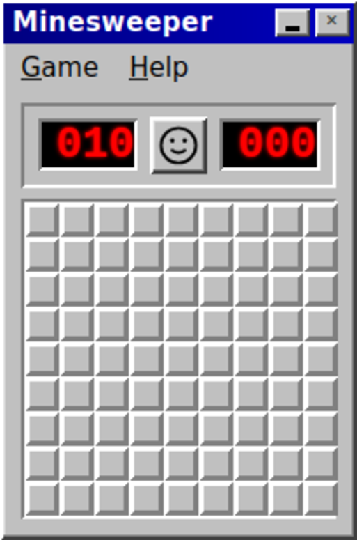

# grr — Minesweeper

A retro Windows Minesweeper as a native desktop app — **~10 MB, two files, no Electron, no Node, no Chromium.**

Built with [tinyjs](https://tinyjs.app): a plain-JS backend (compiled with [txiki.js](https://txikijs.org)) plus the system's own WebKit window. The entire game runs in the page; the backend just hosts the window and nothing else.

<p align="center"></p>

## Features

- **The real thing** — Beginner 9×9/10, Intermediate 16×16/100, Expert 30×16/99; your first click is always safe
- Right-click to flag, **chording** (click a revealed number whose flags already match)
- LED counters and the smiley — dead face when you lose, sunglasses when you win (no popups, like the real thing)
- **3 Lives mode** (Game → 3 Lives): a mine costs a life and auto-flags itself instead of ending the game
- Frameless native window with its own retro title bar — drag it to move the window
- Window resizes itself to fit each board level

## Quick start

```sh
# install tinyjs (once)
curl -fsSL https://tinyjs.app/install | sh

tinyjs dev      # hot-reload development
tinyjs build    # → dist/minesweeper + dist/launcher
./run.sh        # run the built app
```

System requirements:

| OS | Needs |
|---|---|
| Linux | WebKitGTK — `sudo apt install libwebkit2gtk-4.1-0 libgtk-3-0` |
| Windows | WebView2 runtime (preinstalled on Windows 11) |
| macOS | nothing (system WebKit) |

`dev.sh` / `run.sh` set two env vars for one specific dual-GPU KDE/Wayland machine
(`GDK_BACKEND=x11` so the window manager honors the undecorated hint, and
`WEBKIT_DISABLE_COMPOSITING_MODE=1` to dodge a GBM crash). On a stock desktop
plain `tinyjs dev` / `./dist/minesweeper` is all you need — and on macOS/Windows
neither var applies.

## Cross-platform

Same frontend, same backend, identical API — build on each OS to get its binary
(Linux: `minesweeper` + `launcher`, Windows: `minesweeper.exe` + `launcher.exe`,
macOS: `Minesweeper.app` via `tinyjs build`). The built app registers its own
`.desktop` entry on Linux at first run.

## Layout

```
src/main.js          backend: setTitle, setResizable(false), center. That's it.
src/frontend/        the whole game — index.html, style.css, app.js
tinyjs.json          app manifest (frameless chrome, window size, id)
dev.sh / run.sh      launchers with machine-specific env vars
docs/screenshot.png
```

---

*Named after the sound you make when you click a mine.*
